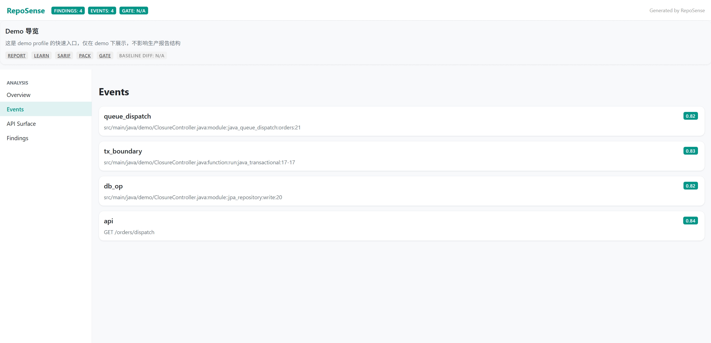
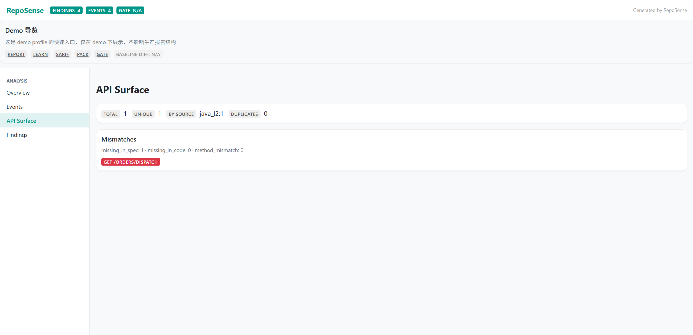
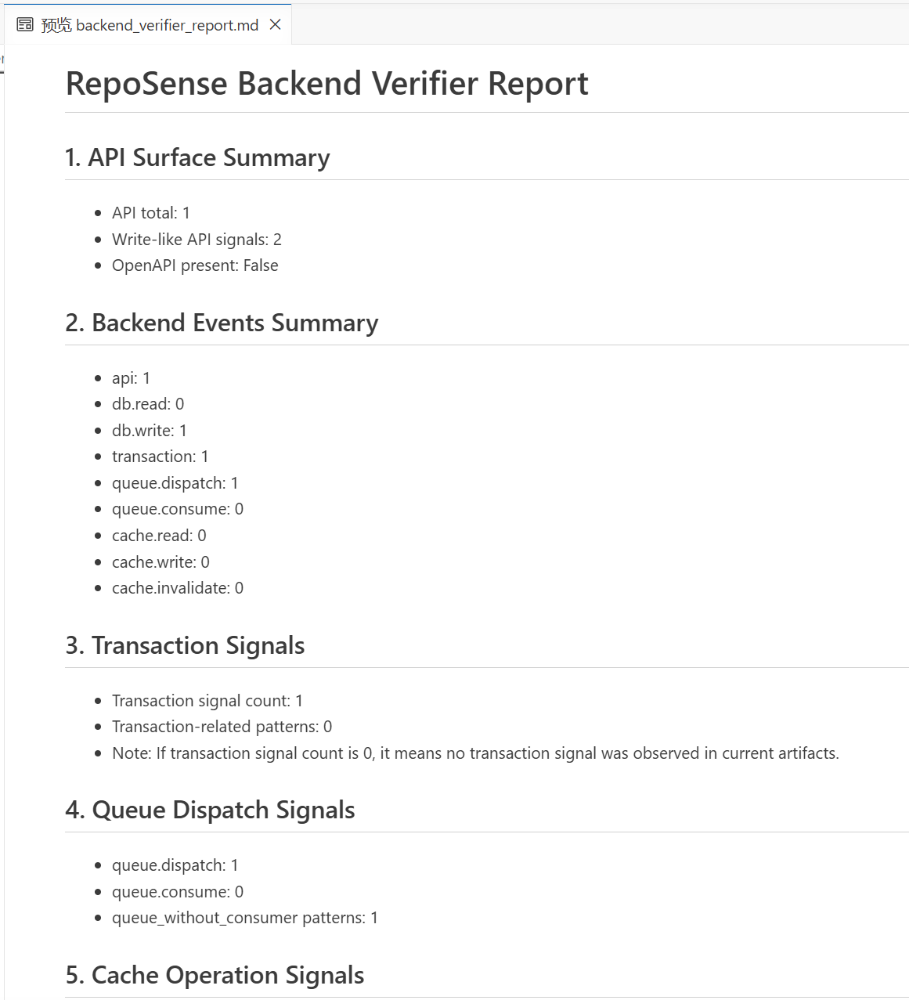

# RepoSense

**Backend transaction, side-effect, and upgrade-context system for AI-assisted projects.**

RepoSense turns repositories into evidence-backed engineering facts, side-effect maps, and upgrade-ready context.
RepoSense turns repositories into auditable engineering facts, deterministic patterns, and grounded engineering insights.

**Language:** English | [简体中文](README.zh-CN.md)

## Why RepoSense

AI can generate a first backend version quickly. The harder part usually starts in the second and third version: maintainability, upgrade confidence, and safe handoff context.

Teams often cannot clearly see:

- which APIs write data,
- where transaction boundaries are observed or missing,
- where queue dispatch and consume signals appear,
- where cache state changes happen,
- which side effects may affect the next AI-assisted change,
- what upgrade context should be handed to the next assistant or engineer.

RepoSense addresses this by converting code into evidence-backed Facts, deterministic Patterns, and grounded Insights that can be replayed and reviewed.

## What RepoSense Helps You Answer

- Which backend APIs trigger writes and side effects?
- Where are transaction signals observed or not observed?
- Which side effects may affect the next change?
- What changed between two runs?
- Is this repository ready for the next AI-assisted upgrade?
- What context should be handed to the next AI-assisted upgrade?

## Core Flow

```text
Code Repo
  -> Facts
  -> Patterns
  -> Insights
       \
        -> Learn
```

Context Pack turns these outputs into explicit upgrade context for the next AI-assisted maintenance or upgrade cycle.

## Boundary

RepoSense performs conservative, evidence-backed detection. It helps expose backend transaction, side-effect, and upgrade-context signals, but it does not guarantee full backend correctness or safe upgrades.

## 3-Minute Quickstart

Run from repository root (PowerShell on Windows):

```powershell
powershell -ExecutionPolicy Bypass -File tools/demo_run.ps1
```

## After Running the Demo, You Will See

- `report.html`
- `backend_verifier_report.json` and `backend_verifier_report.md`
- `patterns.json` and `pattern_summary.json`
- `ai_summary.md`
- `ai_risks/risks.md`
- `ai_explain/*/explain.md` (at least one)
- `exports/context_pack.zip`
- `run_manifest.json`

## What RepoSense Can Do Today

### OSS Local Capabilities

- Findings / Events / Evidence
- `report.json` and `report.html`
- `event_graph.json`
- `api_surface.json`
- Context Pack export
- SARIF export
- Quality Gate
- Baseline & Diff
- Run Manifest
- Learn local site (`learn/index.html`)
- Deterministic pattern outputs:
  - `patterns.json` / `pattern_summary.json`
- Local, evidence-backed, limited AI-derived outputs:
  - `ai summary`
  - `ai risks`
  - `ai explain`
  - `ai ask` (constrained)

### Roadmap / Hosted Enhancements

- Guided repair playbooks
- Multi-run history and trend workspace
- Team collaboration workspace
- Enterprise/compliance reporting templates
- Long-term upgrade advisor

## Context Pack / Upgrade Context

Context Pack is the handoff layer for the next AI-assisted change.

It packages API surface, backend events, findings, evidence, quality gate, baseline diff, and run manifest into a reproducible context bundle.

## What RepoSense Is Not

- Not a general AI code chat.
- Not a proof of full backend correctness.
- Not a tool that guarantees all transactions are correct.
- Not a tool that lets models freely roam your entire repository by default.

## Four Product Surfaces

- Analysis: extracts Findings, Events, and Evidence from code repositories.
- Learn: Concepts -> Cases -> Evidence for grounded learning.
- AI Insights: `summary`, `risks`, `explain`, `ask` on top of Facts + Patterns.
- Studio: local run viewer for reports, risks, explain, and evidence/snippet links.

## Trust Principles

- Evidence-first
- Deterministic
- Facts first, source on demand

## AI Grounded Principles

RepoSense AI outputs follow a grounded contract: Facts-only by default, constrained source drill-down only when needed, and explicit `confirmed / inferred / unknown` separation.

## Documentation Entry Points

- [docs/DEMO_QUICKSTART.md](docs/DEMO_QUICKSTART.md)
- [docs/ARCHITECTURE.md](docs/ARCHITECTURE.md)
- [docs/reports/BACKEND_VERIFIER_REPORT.md](docs/reports/BACKEND_VERIFIER_REPORT.md)
- [docs/context-pack/CONTEXT_PACK_SPEC.md](docs/context-pack/CONTEXT_PACK_SPEC.md)
- [docs/AI_GROUNDED_PRINCIPLES.md](docs/AI_GROUNDED_PRINCIPLES.md)
- Full docs index: [docs/INDEX.md](docs/INDEX.md)

## Screenshots / Demo Assets

Release screenshots are tracked in [docs/assets/ASSET_INDEX.md](docs/assets/ASSET_INDEX.md).

Canonical release screenshots are captured from:

- `.reposense_release_demo/current/`
- Regenerate with: `powershell -ExecutionPolicy Bypass -File tools/release_demo.ps1`

Current stable screenshot targets include:

- Overview
- Backend Events
- API Surface

Learn / AI Risks / AI Explain screenshots are captured from the same canonical release demo run.

## Screenshots

RepoSense generates local, evidence-backed reports for backend transaction, side-effect, and upgrade-context inspection.

### Backend Events



### API Surface



### Backend Verifier Report



More screenshots and release assets are tracked in [docs/assets/ASSET_INDEX.md](docs/assets/ASSET_INDEX.md).

## FAQ

### Q1. Why not let AI read the whole repository directly?

RepoSense optimizes for cost, stability, and auditability. Default reasoning is Facts-only; source drill-down is on-demand and evidence-constrained.

### Q2. How is RepoSense different from a normal lint/code scanner?

RepoSense outputs not only Findings, but also Events, Event Graph, Evidence references, deterministic Patterns, and grounded Insights.

### Q3. How is RepoSense different from AI code chat tools?

RepoSense is Facts-first, deterministic, and evidence-backed. Outputs can be replayed and audited via run artifacts.

### Q4. What is Learn for?

Learn is not a static docs page. It is a Concepts -> Cases -> Evidence learning path for grounded engineering understanding.

### Q5. What languages are supported today?

Current OSS coverage centers on Python, TypeScript/JavaScript, Java, and SQL signals. See [docs/LANGUAGE_SUPPORT_MATRIX.md](docs/LANGUAGE_SUPPORT_MATRIX.md) for the exact current matrix.

## Development

```bash
python -m unittest -v
```

## License & Security

- License: [LICENSE](LICENSE)
- Contributing: [CONTRIBUTING.md](CONTRIBUTING.md)
- Security: [SECURITY.md](SECURITY.md)
