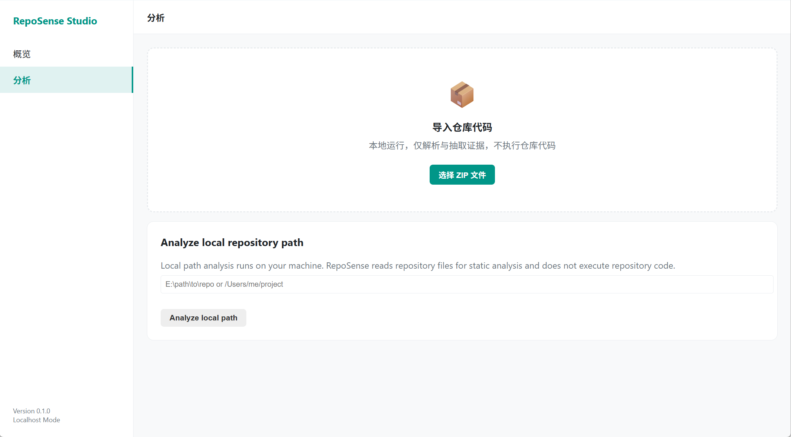

# RepoSense

**面向 AI 辅助开发项目的后端事务、副作用与升级上下文系统。**

RepoSense 会把仓库转成可审计的工程事实、副作用地图和面向下一轮 AI 升级的上下文包。
RepoSense 将代码沉淀为可复核的工程事实、确定性模式和 grounded 工程洞察。

**语言：** [English](./README.md) | 简体中文

## 为什么需要 RepoSense

AI 可以很快写出后端第一版，真正困难通常出现在第二版、第三版：后续维护、升级把控和上下文交接。

团队常见问题是看不清：

- 哪些 API 在写数据；
- 事务边界在哪里被观察到、哪里缺失；
- 哪些路径触发了队列派发或消费信号；
- 哪些缓存状态在被读写或失效；
- 哪些副作用会影响下一轮 AI 修改；
- 下一轮升级前应交接哪些 upgrade context。

RepoSense 的做法是把代码转成 evidence-backed 的 Facts、deterministic 的 Patterns、grounded 的 Insights，帮助团队在升级前先看清风险与上下文。

## RepoSense 帮你回答什么

- 哪些后端 API 触发了写入和副作用？
- 事务信号在哪里出现、哪里未出现？
- 哪些副作用会影响下一次改动？
- 两次 run 之间到底变化了什么？
- 当前仓库是否适合进入下一轮 AI 辅助升级？
- 下一轮 AI 升级应交接什么上下文？

## 核心流

```text
Code Repo
  -> Facts
  -> Patterns
  -> Insights
       \
        -> Learn
```

Context Pack 会把这些产物打包成可复现的升级上下文，用于下一轮 AI 辅助维护与升级。

## 边界说明

RepoSense 采用保守、可追证据的检测方式。它帮助暴露后端事务、副作用与升级上下文信号，但不保证完整后端正确性，也不保证升级绝对安全。

## 3 分钟 Quickstart

在仓库根目录（Windows PowerShell）运行：

```powershell
powershell -ExecutionPolicy Bypass -File tools/demo_run.ps1
```

## 运行 Demo 后你会看到

- `report.html`
- `backend_verifier_report.json` 与 `backend_verifier_report.md`
- `patterns.json` 与 `pattern_summary.json`
- `ai_summary.md`
- `ai_risks/risks.md`
- `ai_explain/*/explain.md`（至少一份）
- `exports/context_pack.zip`
- `run_manifest.json`

## Studio UI

RepoSense 已包含一个本地 Studio UI，用于交互式分析仓库。

启动：

```powershell
.\.venv\Scripts\python.exe -m reposense studio serve --port 8010
```

然后打开：

`http://127.0.0.1:8010`

### Studio UI



Studio 当前支持两种本地流程：

1. 上传仓库 ZIP；
2. 输入本地仓库路径并分析。

当前 Studio 支持：

- 通过 ZIP 或本地路径导入仓库；
- 点击开始分析；
- 查看 run 状态；
- 打开生成的 report、Learn、SARIF、Context Pack、run manifest 等产物。

边界说明：

- Studio 是本地开发者 UI，不是云端 SaaS。
- 本地路径分析只适用于本机 Studio。
- 浏览器不会默认把整个本地目录上传到云端。
- RepoSense 做静态读取分析，不执行仓库代码。
- 如果要分析本地目录，继续使用 CLI。

```powershell
.\.venv\Scripts\python.exe -m reposense ci run --repo <repo-path> --out .reposense_runs --profile demo --with-context-pack
```

## RepoSense 当前能力

### 已落地能力（OSS Local Capabilities）

- Findings / Events / Evidence
- `report.json` 与 `report.html`
- `event_graph.json`
- `api_surface.json`
- Context Pack 导出
- SARIF 导出
- Quality Gate
- Baseline & Diff
- Run Manifest
- Learn 本地站点（`learn/index.html`）
- 确定性模式产物：
  - `patterns.json` / `pattern_summary.json`
- 本地、证据约束、能力受限的 AI 派生产物：
  - `ai summary`
  - `ai risks`
  - `ai explain`
  - `ai ask`（受限）

### 路线图 / 托管增强（Roadmap / Hosted Enhancements）

- Guided repair playbooks
- Multi-run history 与趋势工作区
- Team collaboration workspace
- Enterprise/compliance reporting templates
- Long-term upgrade advisor

## Context Pack / 升级上下文

Context Pack 不是普通导出包，而是下一轮 AI 辅助修改的交接层。

它将 API surface、backend events、findings、evidence、quality gate、baseline diff、run manifest 打包为可复现上下文。

## RepoSense 不是什么

- 不是通用 AI code chat。
- 不是完整后端正确性证明器。
- 不是保证所有事务都正确的工具。
- 不是默认允许 AI 整仓自由漫游源码的工具。

## 四个产品面

- Analysis：从代码中抽取 Findings / Events / Evidence。
- Learn：Concepts -> Cases -> Evidence 的 grounded 学习路径。
- AI Insights：基于 Facts + Patterns 的 `summary` / `risks` / `explain` / `ask`。
- Studio：本地 run 视图，聚合报告、风险、解释与证据/片段深链。

## 产品原则

- Evidence-first
- Deterministic
- Facts first, source on demand

## AI Grounded 原则

RepoSense 的 AI 输出遵循 grounded 契约：默认 facts-only，必要时才做受约束源码下钻，并明确区分 `confirmed / inferred / unknown`。

## 核心文档入口

- [docs/DEMO_QUICKSTART.md](docs/DEMO_QUICKSTART.md)
- [docs/ARCHITECTURE.md](docs/ARCHITECTURE.md)
- [docs/reports/BACKEND_VERIFIER_REPORT.md](docs/reports/BACKEND_VERIFIER_REPORT.md)
- [docs/context-pack/CONTEXT_PACK_SPEC.md](docs/context-pack/CONTEXT_PACK_SPEC.md)
- [docs/AI_GROUNDED_PRINCIPLES.md](docs/AI_GROUNDED_PRINCIPLES.md)
- 完整文档索引：[docs/INDEX.md](docs/INDEX.md)

## 截图 / Demo 素材

发布截图清单统一维护在 [docs/assets/ASSET_INDEX.md](docs/assets/ASSET_INDEX.md)。

发布截图统一来自：

- `.reposense_release_demo/current/`
- 可通过 `powershell -ExecutionPolicy Bypass -File tools/release_demo.ps1` 重新生成

当前稳定截图目标包括：

- Overview
- Backend Events
- API Surface

Learn、AI Risks、AI Explain 截图也来自同一个 canonical release demo run。

## 截图预览

RepoSense 会生成本地、可追证据的后端事务、副作用与升级上下文报告。

### 后端事件


### API Surface


### 后端验证报告


更多截图与发布素材见 [docs/assets/ASSET_INDEX.md](docs/assets/ASSET_INDEX.md)。

## FAQ

### Q1. 为什么不直接让 AI 读整个仓库？

因为我们优先保证成本、稳定性与可审计性。默认先做 facts-only 推理；只有证据不足时，才做受约束 source drilldown。

### Q2. RepoSense 和普通 scanner 有什么区别？

RepoSense 不只给 findings，还会给出 Events、Event Graph、Evidence 引用、deterministic Patterns 与 grounded Insights。

### Q3. RepoSense 和 AI code chat 有什么区别？

RepoSense 是 Facts-first、可复现、可追证据的工程洞察流程，不是开放式聊天先行。

### Q4. Learn 的定位是什么？

Learn 不是静态文档页，而是 Concepts -> Cases -> Evidence 的知识内化路径。

### Q5. 当前支持哪些语言？

当前开源覆盖重点为 Python、TypeScript/JavaScript、Java、SQL 信号。详见 [docs/LANGUAGE_SUPPORT_MATRIX.md](docs/LANGUAGE_SUPPORT_MATRIX.md)。

## 开发

```bash
python -m unittest -v
```

## 许可证与安全

- License: [LICENSE](LICENSE)
- Contributing: [CONTRIBUTING.md](CONTRIBUTING.md)
- Security: [SECURITY.md](SECURITY.md)
