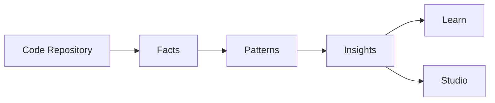

# Product Flow

```mermaid
flowchart LR
  A["Code Repository"] --> B["Facts"]
  B --> C["Patterns"]
  C --> D["Insights"]
  D --> E["Learn"]
  D --> F["Studio"]
```

Principles:

- Evidence-first
- Deterministic outputs
- Facts first, source on demand
