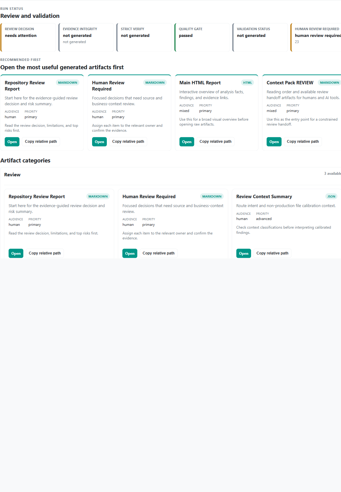

# RepoSense Studio UI

## What it is

RepoSense Studio is a local Studio UI for interactive repository analysis.

## Start Studio

```powershell
.\.venv\Scripts\python.exe -m reposense studio serve --port 8010
```

Open:

`http://127.0.0.1:8010`

## Current workflow

1. Choose one import mode:
   - Upload a repository ZIP, or
   - Analyze a local repository path.
2. Start analysis.
3. Wait for run completion.
4. Open generated outputs:
   - `report.html`
   - Learn UI
   - SARIF
   - Context Pack
   - `run_manifest.json`
   - backend verifier report
   - local AI-derived outputs if generated

## Analyze a local repository path

1. Start Studio.
2. Enter a local repository path in `Analyze local repository path`.
3. Click `Analyze local path`.
4. Configure run profile/ruleset/specs and start analysis.
5. Track runs and open artifacts from the same run list.

Boundary notes:

- Local path analysis is local-only in Studio.
- RepoSense reads repository files for static analysis and does not execute repository code.
- Browser flow does not upload the full local directory to a hosted cloud service by default.

## Repository Review panel

Studio can display Repository Review artifacts generated by RepoSense when they exist in a run directory.

The panel is read-only. It links to:

- `repository_review_report.md`
- `human_review_required.md`
- Code Health artifacts such as `code_health_summary.json`
- Permission Auditor artifacts such as `permission_risk_report.md`
- AuthZ Matrix artifacts such as `authz_matrix_report.md` and `authz_negative_test_plan.md`
- Context Pack REVIEW files such as `context_pack/REVIEW/README.md`

The panel does not execute review generation automatically. Generate the review artifacts with the existing CLI commands, then refresh the Studio run list.

For a complete local demo that produces the artifacts shown in this panel:

```powershell
powershell -ExecutionPolicy Bypass -File tools/review_demo.ps1
```

The canonical output is `.reposense_review_demo/current/`.

The recommended screenshot target for this panel is `studio-review-panel.png`.

Boundary notes:

- Studio surfaces evidence-backed review artifacts; it does not replace human code review.
- Missing review artifacts are shown as an empty state, not as a pass result.
- Suspected findings require human confirmation.

## Run Artifact Cards

Run details organize generated outputs into read-only artifact cards.

- The status header shows the Repository Review decision, Evidence Integrity, Strict Verify, Quality Gate, validation state, and Human Review Required count when those artifacts are available.
- `Recommended First` shows up to four generated entry points in a stable order: Repository Review Report, Human Review Required, the main HTML report, and Context Pack REVIEW.
- Remaining artifacts are grouped by review area, including backend effects, transactions and database coverage, messaging reliability, Code Health, permission and AuthZ, validation, and Context Pack handoff.
- Advanced and raw artifacts are collapsed by default. Each card explains its format, audience, intended use, and run-relative path.
- A missing artifact is shown as `not generated`; Studio does not turn it into a zero finding count or create a link for it.

Studio only reads run artifacts. It does not generate, modify, or validate artifacts from the browser, and a passed status does not prove repository safety, authorization correctness, or transaction correctness.



The screenshot above comes from the canonical Review Demo. The 2026-07-30 manual browser checklist and environment record are documented in [STUDIO_VISUAL_QA_V02.md](../validation/STUDIO_VISUAL_QA_V02.md).

## Studio API Privacy Boundary

Studio uses local filesystem paths internally to read repositories, persist run
state, and write logs. Public HTTP run payloads do not return those absolute
paths. `GET /api/runs` and `GET /api/runs/<run_id>` expose an explicit
allowlisted run model; internal fields such as log, workspace, repository,
source, output, and run directory paths remain private.

Generated artifacts are opened through run-relative URLs such as
`/runs/<run_id>/report.html`. A local repository path submitted for analysis is
not returned through historical run APIs. This boundary reduces accidental
disclosure through logs, screenshots, browser extensions, or copied API
responses without changing internal log storage or deleting local artifacts.

## What Studio does not do yet

- It does not currently expose a browser folder picker for local directories.
- It does not upload data to a hosted cloud service by default.
- It does not replace CLI workflows.
- It does not guarantee backend correctness.

## CLI alternative

For local directory analysis:

```powershell
.\.venv\Scripts\python.exe -m reposense ci run --repo <repo-path> --out .reposense_runs --profile demo --with-context-pack
```

Then open:

```powershell
.\.venv\Scripts\python.exe -m reposense show <run_dir> --open
```

## Implementation references

- `webui/studio/index.html`
- `reposense/studio/server.py`
- `reposense/studio/jobs.py`
- `reposense/cli.py`
